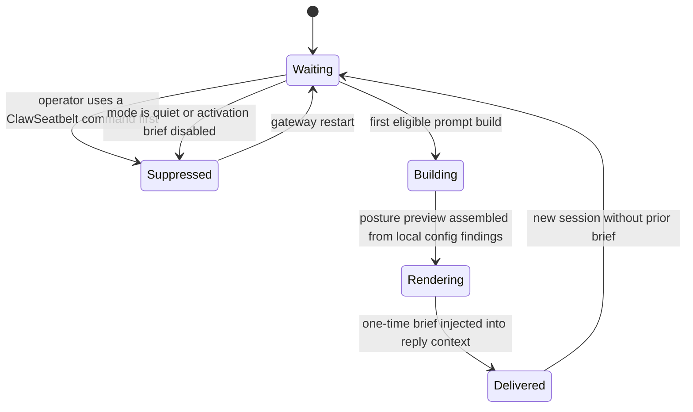
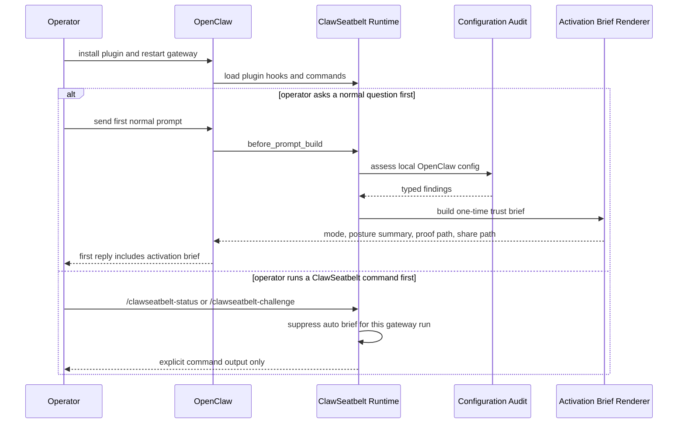
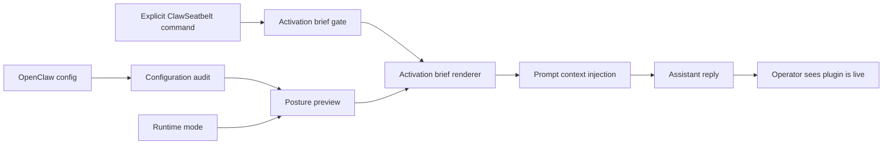

# Activation Brief Architecture

## Purpose

ClawSeatbelt should not disappear into silence after install. The activation brief closes the gap between "plugin loaded" and "operator understands what is live" by injecting one calm, one-time trust brief into the next eligible assistant reply.

Current runtime surface: automatic first-session brief via `before_prompt_build`

## State Machine

## Sequence Diagram

## Data Flow

## Design Guardrails

- Show the brief once, then get out of the way.
- Keep it short enough to survive an unrelated conversation.
- Use local posture only. Do not auto-run remote checks or auto-share artifacts.
- Point to one proof command and one share-safe follow-up, not a menu of seven commands.
- Suppress the brief if the operator already engaged ClawSeatbelt directly.
