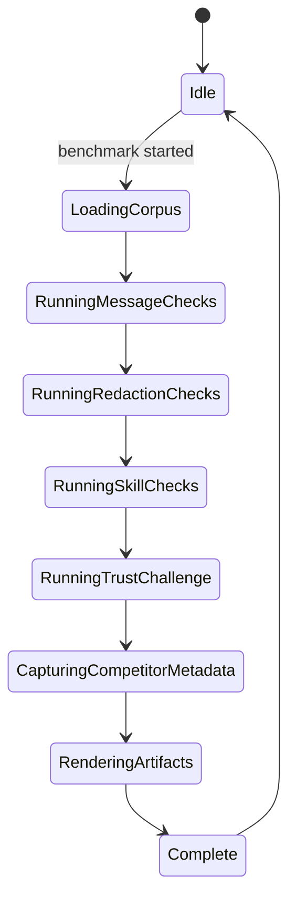
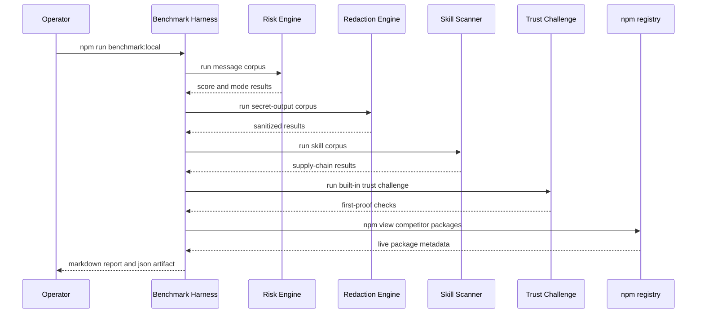
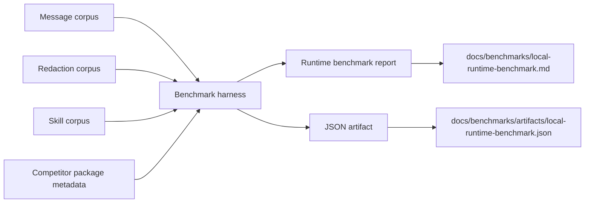

# Benchmark Harness

## Purpose

ClawSeatbelt needs a repeatable proof layer that can be rerun as the product evolves. The benchmark harness exists to measure local runtime behavior against a shared corpus, record the current trust challenge results, and snapshot live competitor package availability.

Current runtime surface: `npm run benchmark:local`

Install-path verification is documented separately in [docs/architecture/openclaw-lab-verifier.md](openclaw-lab-verifier.md).
Live competitor comparison is documented separately in [docs/architecture/competitor-lab.md](competitor-lab.md).

## State Machine

## Sequence Diagram

## Data Flow

## Design Guardrails

- Keep the harness deterministic for local ClawSeatbelt behavior.
- Separate live competitor metadata from efficacy claims.
- Treat the harness as proof for this repository, not as a final public marketing shootout.
- Publish caveats with every report so artifact strength is not confused with full category proof.
- Keep install-path verification separate from corpus scoring so a package-trust regression does not hide inside performance or detection numbers.
