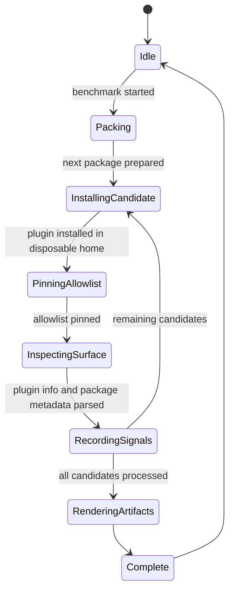
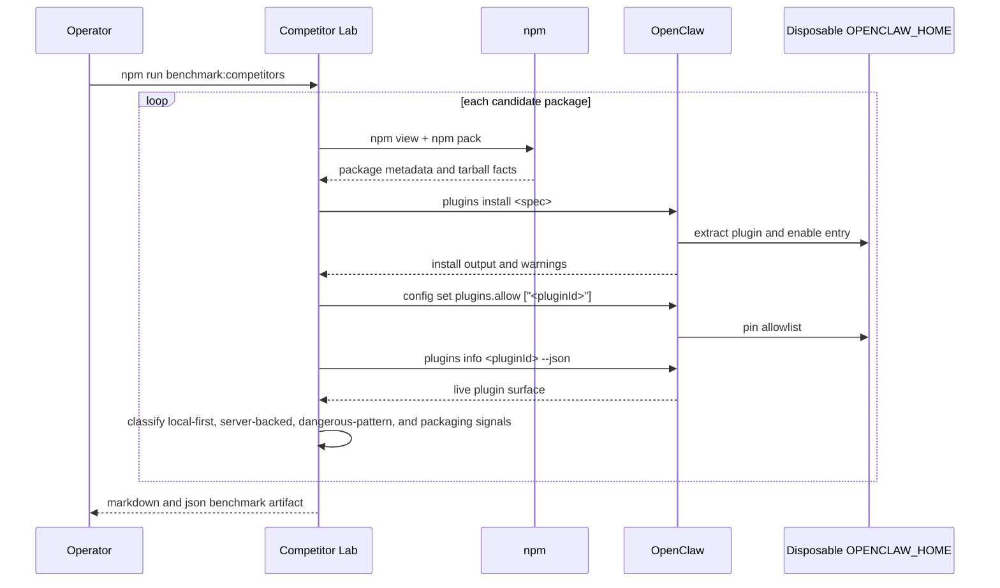
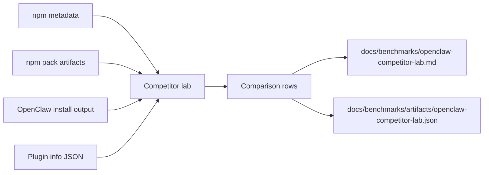

# Competitor Lab

## Purpose

ClawSeatbelt cannot earn the phrase "best OpenClaw plugin" from internal tests alone. The competitor lab exists to install real rival packages into disposable OpenClaw homes, inspect the live plugin surface they register, and compare their install trust story against ClawSeatbelt under the same loader.

Current runtime surfaces:

- `npm run benchmark:competitors`
- `npm run benchmark:competitors:docs`

## State Machine

## Sequence Diagram

## Data Flow

## Design Guardrails

- Compare what the real OpenClaw loader sees, not what README copy promises.
- Keep verdicts narrow. Install trust and plugin surface are not the same as detection quality.
- Treat server reachability, auto-registration, quotas, and dangerous-pattern warnings as first-class operator signals.
- Use the lab to sharpen ClawSeatbelt before making category claims.
