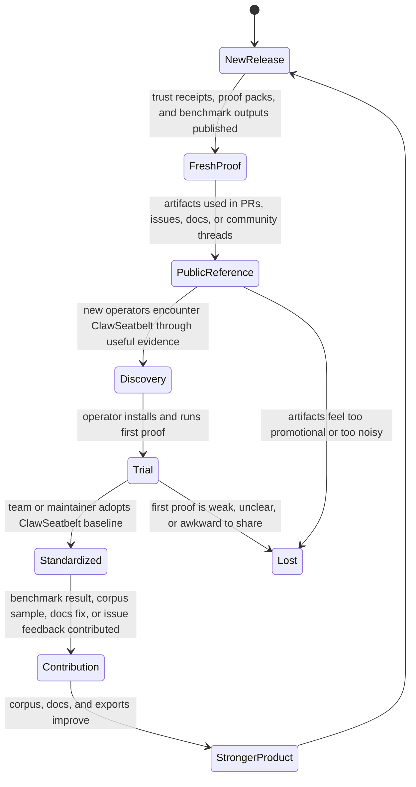
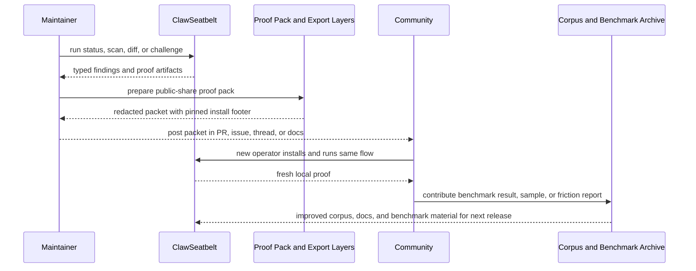
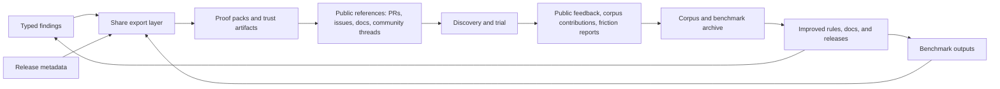

# Compounding Moat Architecture

## Purpose

ClawSeatbelt should become easier to choose over time because its artifacts, corpus, and public proof reinforce each other. This map defines how that compounding loop works without relying on hidden telemetry or manipulative growth mechanics.

## State Machine

## Sequence Diagram

## Data Flow

## Design Guardrails

- Evidence should compound publicly. User data should not.
- Corpus growth must come from explicit contributions, reproduced attacks, and synthetic fixtures.
- Public references should still be useful if the reader never installs the plugin.
- Clean-system outputs matter as much as risky-system outputs for long-term adoption.
- If measurement requires hidden telemetry, the loop has drifted off course.
