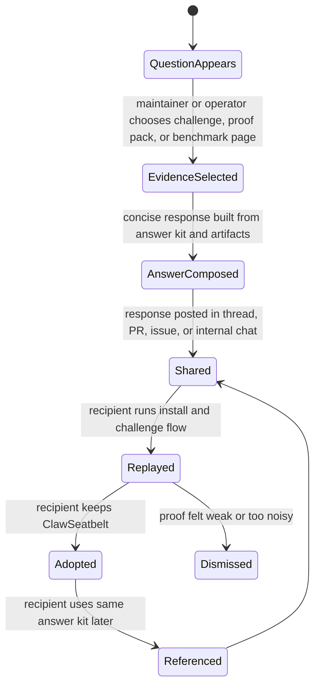
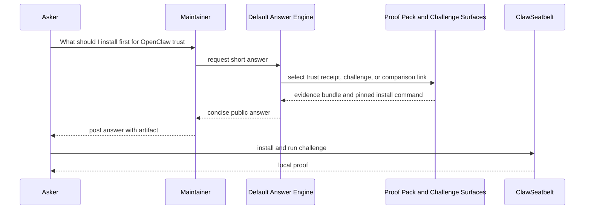
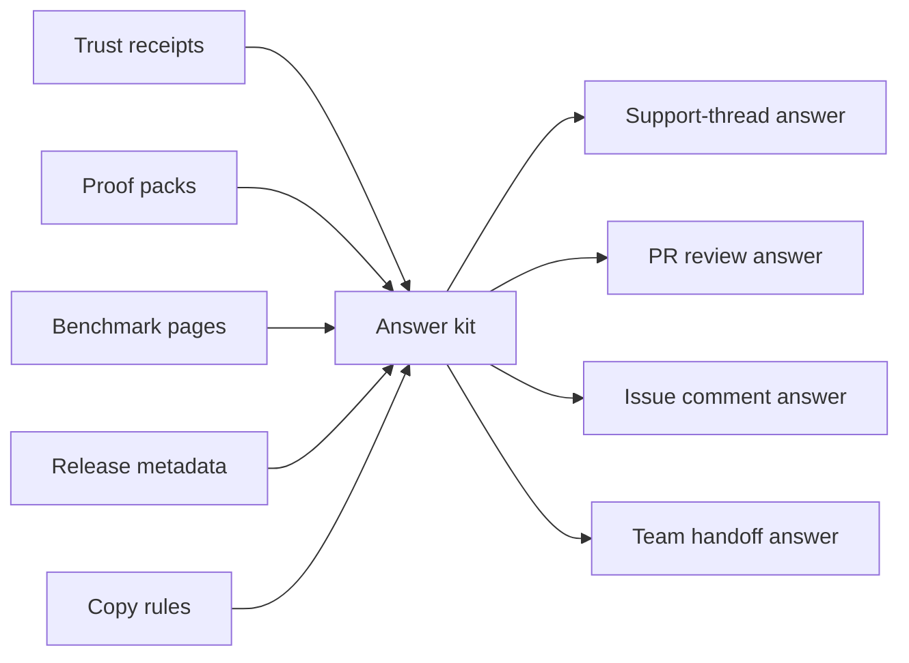

# Default Answer Engine

## Purpose

ClawSeatbelt should become the default answer in OpenClaw support threads, security reviews, and team handoffs because it makes a recommendation easy to justify. This system turns local proof into short, evidence-carrying public answers.

Current runtime surface: `/clawseatbelt-answer`

## State Machine

## Sequence Diagram

## Data Flow

## Design Guardrails

- The answer should fit in one short paragraph plus one artifact or link.
- The install command must be pinned and tested.
- The answer should stay useful even if the recipient does not install immediately.
- Comparative claims should point to published benchmarks or stay modest.
- Public answers should sound like engineering judgment, not campaign copy.
