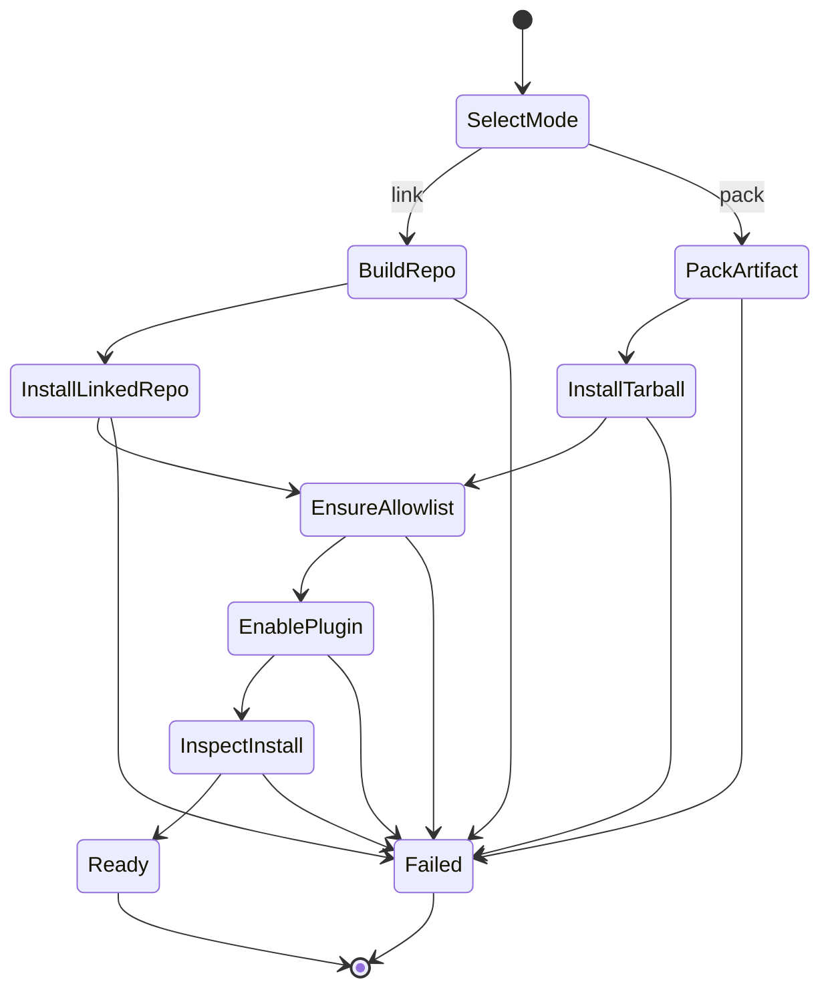
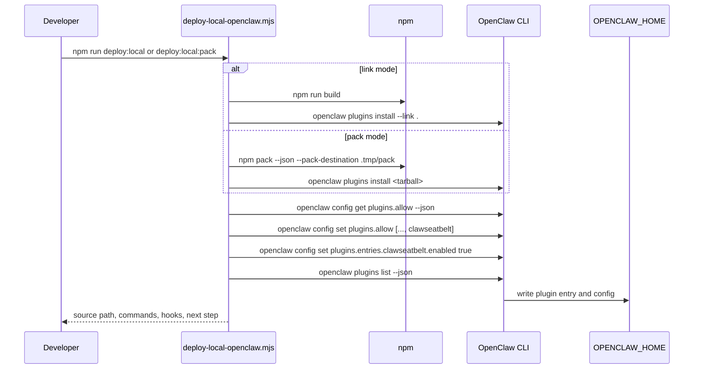
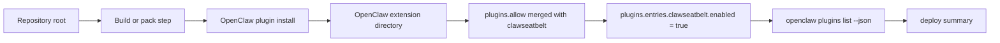

# Local Deploy

## Purpose

ClawSeatbelt has two local deployment modes:

- `link` for fast iteration against the current repository checkout
- `pack` for release-like verification against the exact tarball that OpenClaw will consume

## State Machine

## Sequence

## Data Flow

## Notes

- `link` mode is the fastest inner loop and points OpenClaw at the repository checkout.
- `pack` mode is the safer release rehearsal because it exercises the tarball OpenClaw actually installs.
- Local terminal publishing is a different path. If `publishConfig.provenance` is enabled, local `npm publish` fails with `provider: null` because there is no GitHub OIDC provider in a plain shell session.
