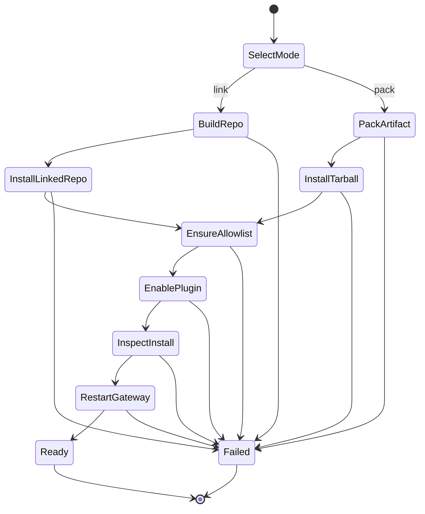
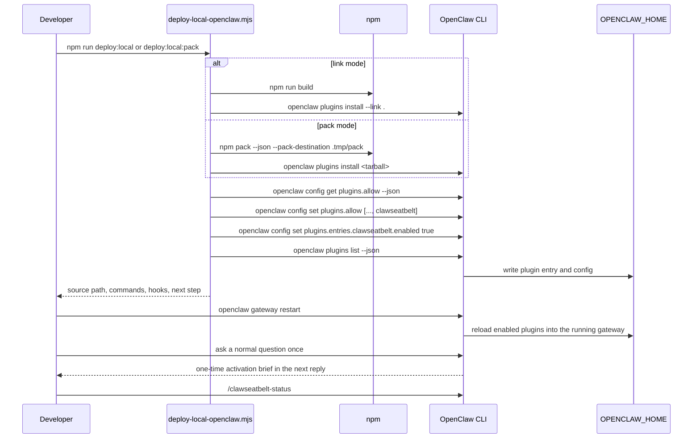

# Local Deploy

## Purpose

ClawSeatbelt has two local deployment modes:

- `link` for fast iteration against the current repository checkout
- `pack` for release-like verification against the exact tarball that OpenClaw will consume

## State Machine

## Sequence

## Data Flow

```mermaid
flowchart LR
  A[Repository root] --> B[Build or pack step]
  B --> C[OpenClaw plugin install]
  C --> D[OpenClaw extension directory]
  D --> E[plugins.allow merged with clawseatbelt]
  E --> F[plugins.entries.clawseatbelt.enabled = true]
  F --> G[openclaw plugins list --json]
  G --> H[deploy summary]
  H --> I[gateway restart]
  I --> J[live plugin session]
  J --> K[first-reply activation brief]
```

## Notes

- `link` mode is the fastest inner loop and points OpenClaw at the repository checkout.
- `pack` mode is the safer release rehearsal because it exercises the tarball OpenClaw actually installs.
- OpenClaw can warn that `plugins.allow` is empty during the initial install before the allowlist write runs. That warning is transient on a clean first install.
- The deploy script confirms install metadata immediately, but a running gateway still needs a restart before the plugin becomes active in the live session.
- After the restart, the next normal assistant reply should include a one-time activation brief unless the operator immediately uses a ClawSeatbelt command first.
- Local terminal publishing is a different path. If `publishConfig.provenance` is enabled, local `npm publish` fails with `provider: null` because there is no GitHub OIDC provider in a plain shell session.
