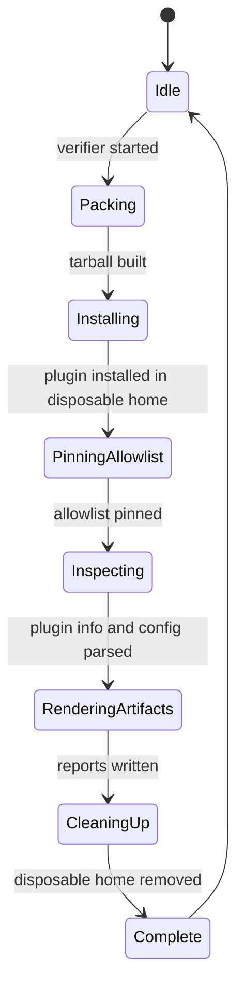
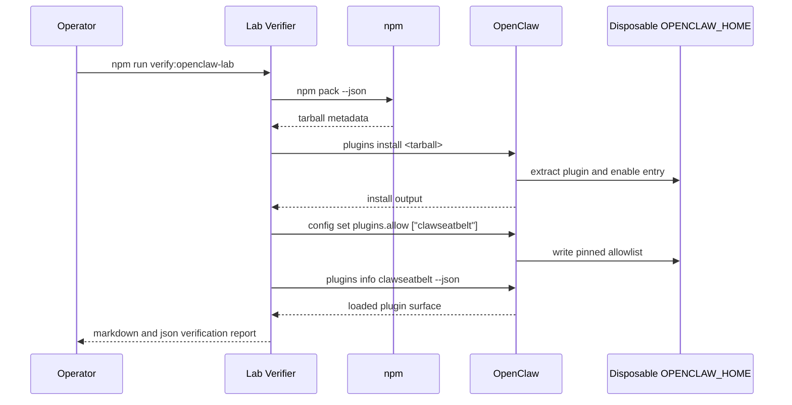
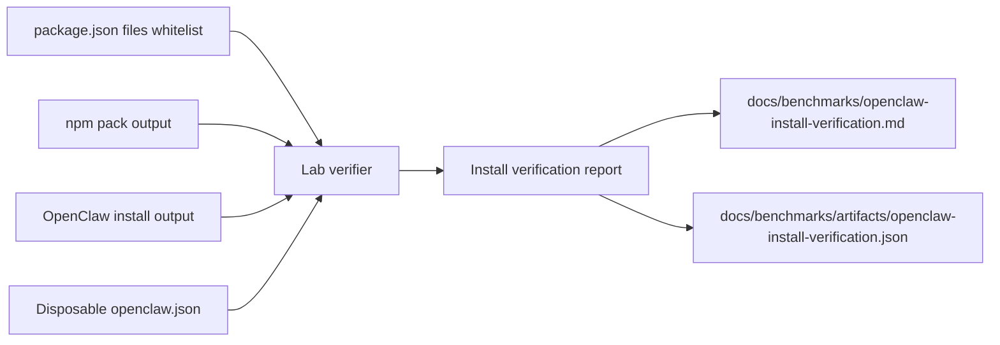

# OpenClaw Lab Verifier

## Purpose

ClawSeatbelt cannot claim install trust if the real OpenClaw installer complains about the tarball. The OpenClaw lab verifier exists to package the current worktree, install it into a disposable `OPENCLAW_HOME`, pin `plugins.allow`, and confirm that the loaded plugin surface matches the trust story in the docs.

Current runtime surfaces:

- `npm run verify:openclaw-lab`
- `npm run verify:openclaw-lab:docs`

## State Machine

## Sequence Diagram

## Data Flow

## Design Guardrails

- Treat install warnings as product bugs until proven otherwise.
- Keep benchmark-only or release-only tooling out of the published plugin tarball.
- Verify the allowlist flow with the real OpenClaw config command, not only with static JSON snippets.
- Make the verifier safe to rerun locally and easy to read in CI logs.
