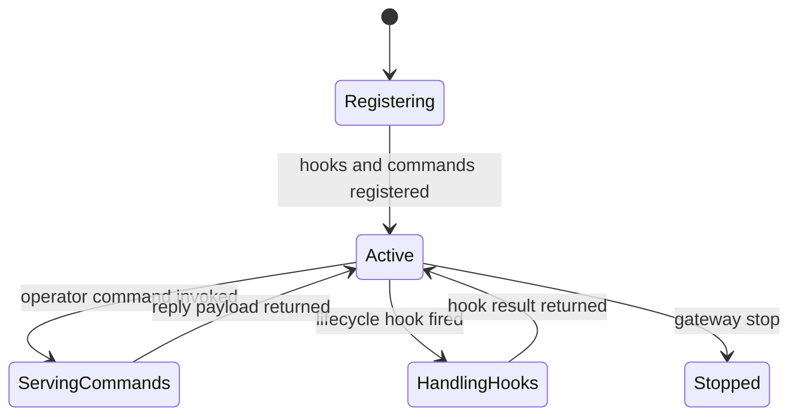
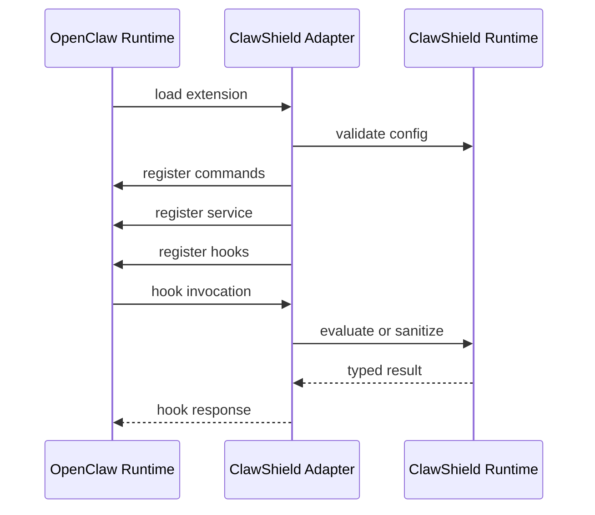
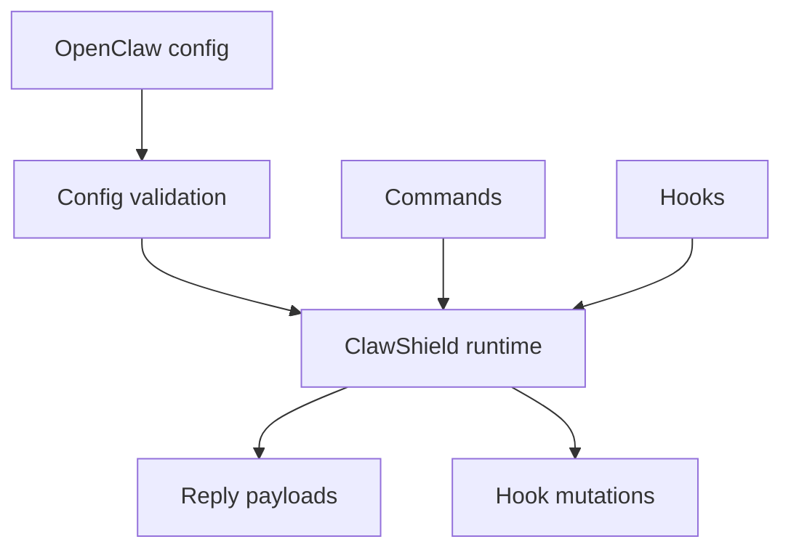

# Plugin Adapter

This component is the seam between ClawShield’s pure logic and OpenClaw’s live runtime. It uses the currently verified extension surface:

- `openclaw.extensions` in `package.json`
- `api.on(...)`
- `api.registerCommand(...)`
- `api.registerService(...)`

## State Machine

## Sequence

## Data Flow

