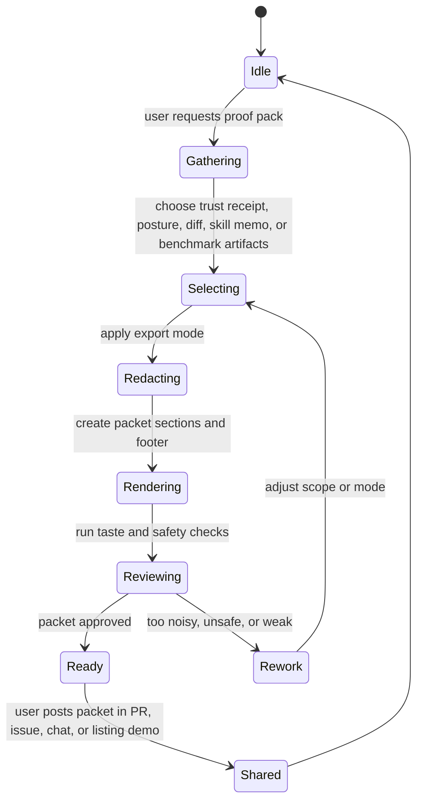
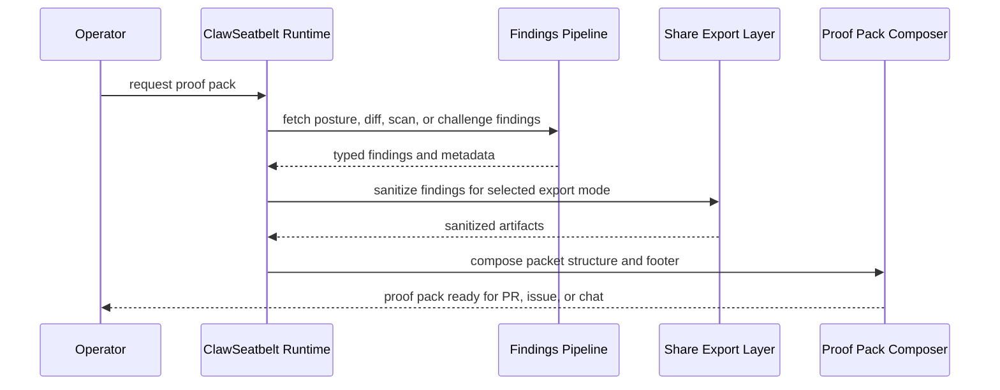
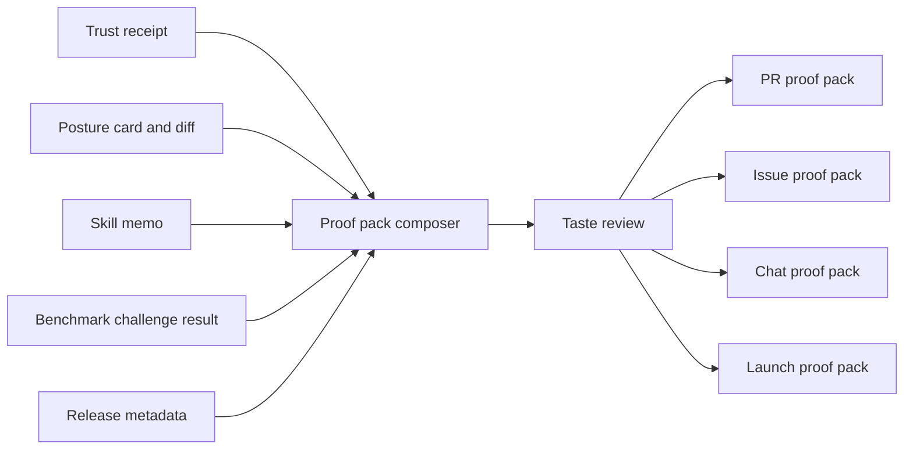

# Proof Pack System

## Purpose

ClawSeatbelt should turn one operator's local proof into a compact packet another operator can act on. The proof pack is the highest-leverage distribution surface because it solves a trust decision in the exact places where OpenClaw users ask for help.

Current runtime surface: `/clawseatbelt-proofpack`

## State Machine

## Sequence Diagram

## Data Flow

## Design Rules

- A proof pack should help a recipient decide, not merely admire.
- First-proof surfaces should point toward the proof pack with one explicit share-safe command.
- One weak section should be removable without breaking the packet.
- Clean results deserve space, not just alarming ones.
- Install guidance must be exact, pinned, and quiet.
- The packet should feel like a field report from a careful operator.
