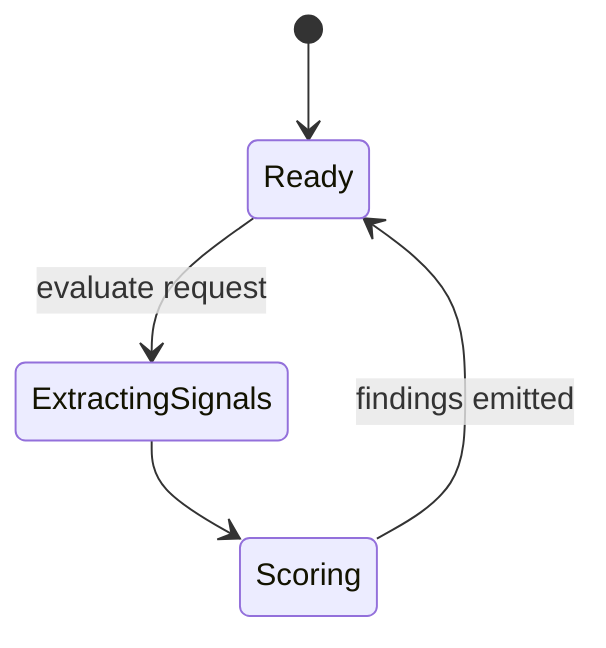
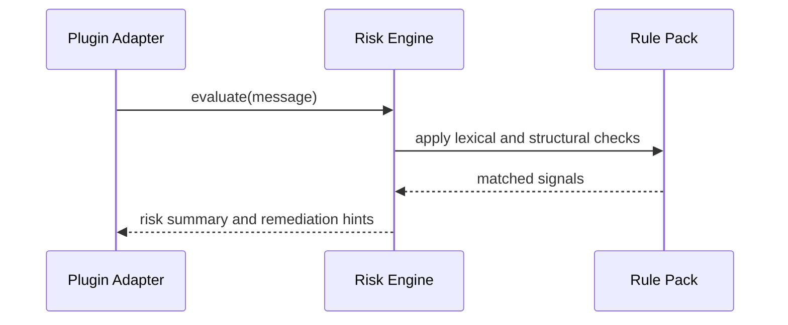

# Risk Engine

The risk engine is a deterministic evaluator for inbound messages. It should be cheap enough for the hot path and clear enough that operators can understand why a message was flagged.

## State Machine

## Evaluation Sequence

## Signal Families

- prompt-injection phrases
- shell execution bait
- obfuscation markers
- credential harvest cues
- suspicious external URLs

## Constraints

- No network calls.
- No model calls.
- O(message length) behavior.
- Findings must carry evidence snippets and remediation.
