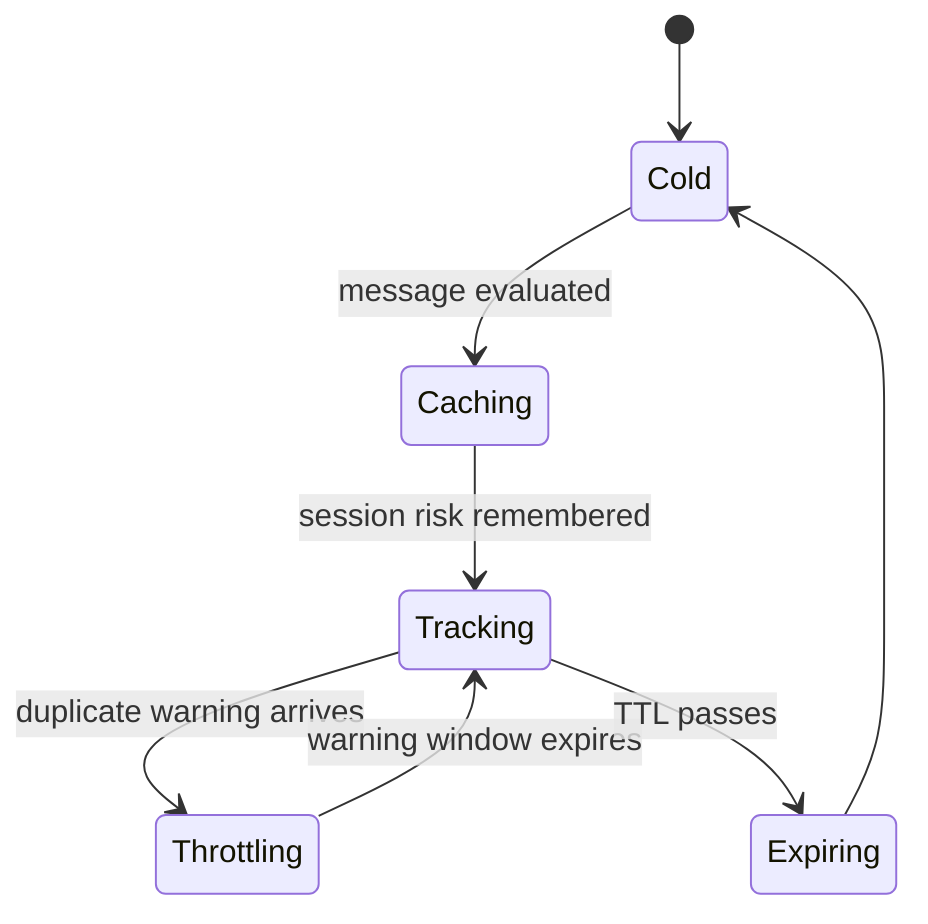
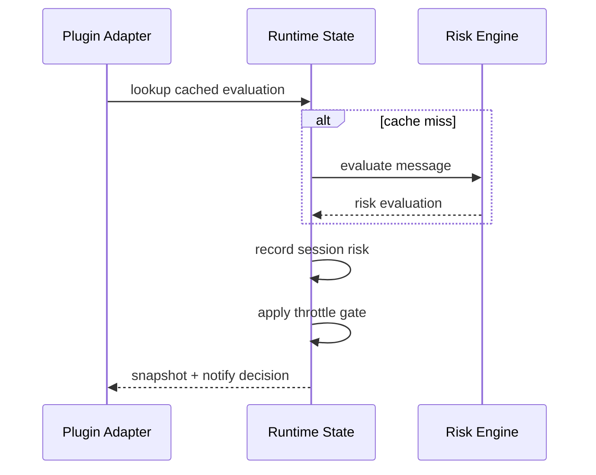
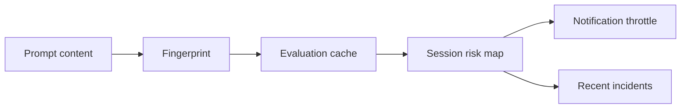

# Runtime State

The runtime state is intentionally simple. It exists to keep the hot path fast and to prevent ClawShield from nagging operators every time the same risky prompt reappears.

## State Machine

## Sequence

## Data Flow

