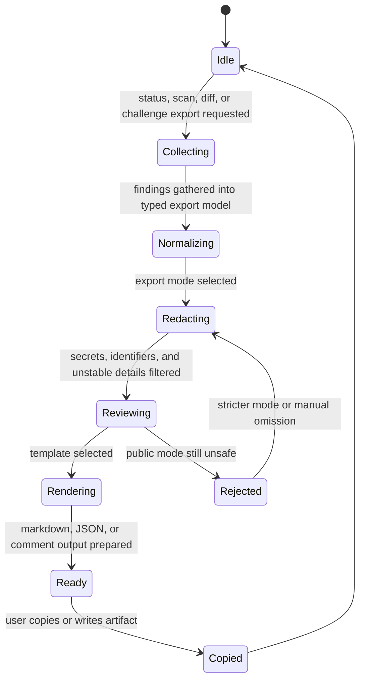
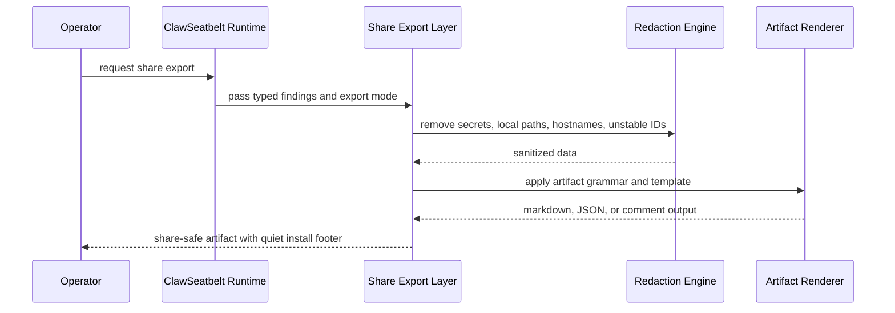
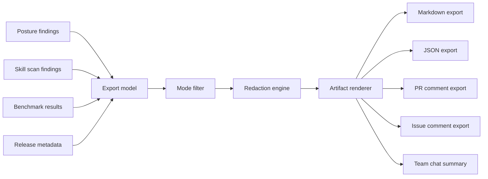

# Share Export System

## Purpose

ClawSeatbelt should be easy to recommend because it can turn local findings into elegant, share-safe artifacts. This subsystem exists to make that recommendation path trustworthy.

Current command surfaces:

- `/clawseatbelt-proofpack --target <markdown|pr-comment|issue-comment|chat> --audience <public|internal|private>`
- `/clawseatbelt-answer --target <support|pr-review|issue|team> --audience <public|internal|private>`

## Export State Machine

## Export Sequence

## Data Flow

## Design Rules

- Every export starts from typed findings, not ad hoc string assembly.
- Public mode should be stricter than internal mode by default.
- Release metadata should inject exact install commands, not floating version hints.
- Status and challenge surfaces should tee operators up for `/clawseatbelt-proofpack`, not strand them after first proof.
- Branding belongs in the footer, after the operator value has landed.
- If an artifact still feels unsafe or noisy, the system should refuse the public export mode.
- Exports should compose cleanly into a larger proof pack without rewriting the core findings.
