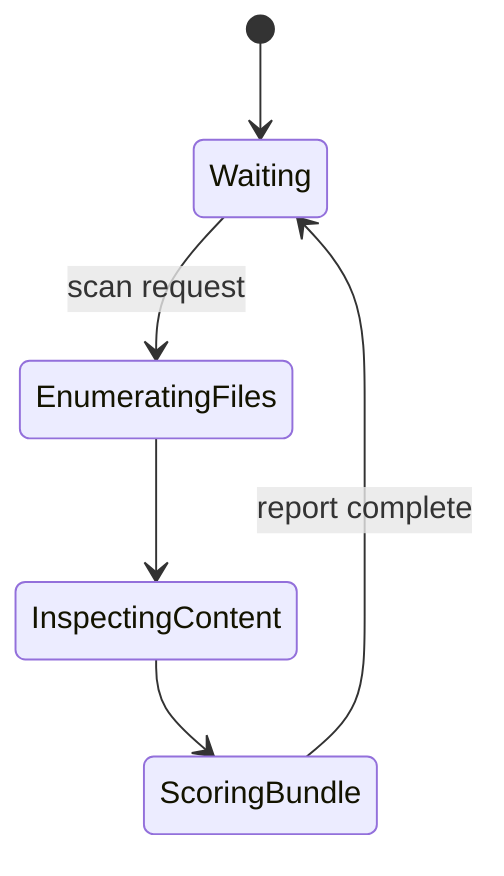
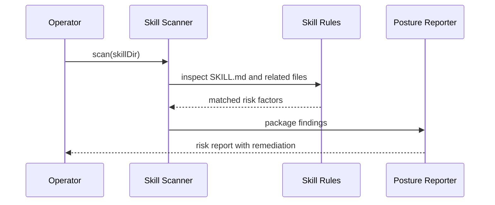
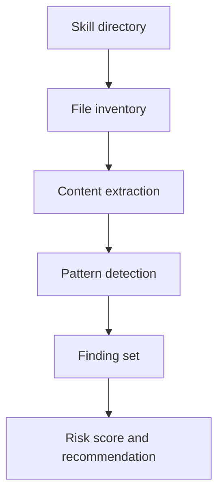

# Skill Scanner

The skill scanner inspects local skill bundles before trust expands. It is deliberately static and local. The target is not perfect malware detection. The target is strong operator judgment with low friction.

## State Machine

## Sequence

## Data Flow

## Initial Detection Targets

- `curl | bash` or equivalent pipe-to-shell flows
- base64 decode plus execution hints
- requests for tokens, wallets, or credentials
- shell installers with broad permissions
- suspicious external fetch patterns
