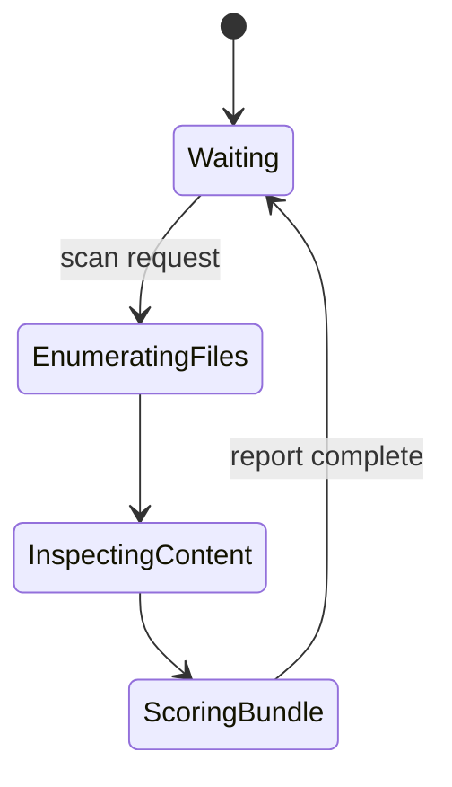
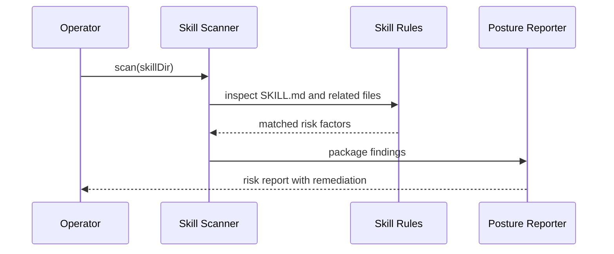
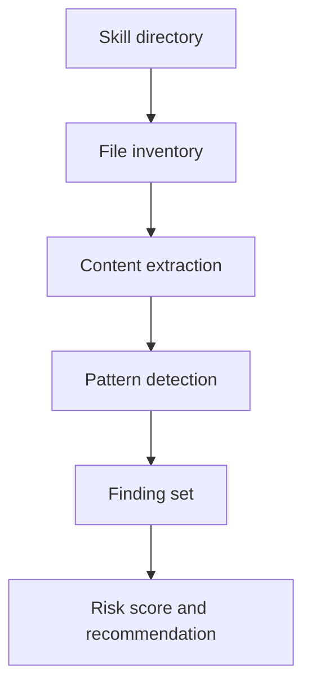

# Skill Scanner

The skill scanner inspects local skill bundles before trust expands. It is deliberately static and local. The target is not perfect malware detection. The target is strong operator judgment with low friction.

## State Machine

## Sequence

## Data Flow

## Initial Detection Targets

- `curl | bash` or equivalent pipe-to-shell flows
- unpinned installs and moving refs such as `latest`, `main`, or bare package names
- install hooks such as `preinstall`, `postinstall`, and `prepare`
- base64 decode plus hidden execution hints such as `node -e`, `python -c`, `bash -c`, or encoded PowerShell
- requests for tokens, wallets, or credentials
- OpenClaw permission expansion such as `exec.security = full`, `tools.profile = full`, or wildcard ingress
- suspicious external fetch patterns including raw content URLs and IP-address downloads
