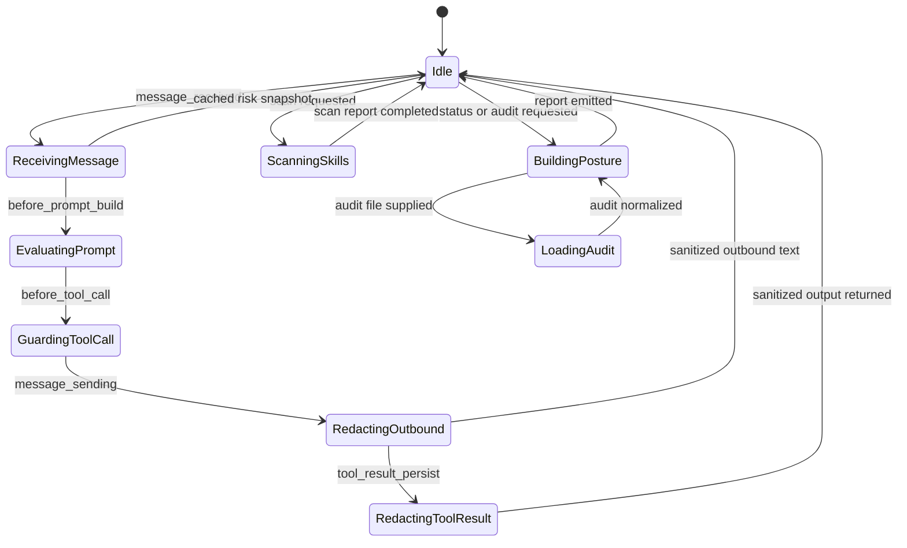
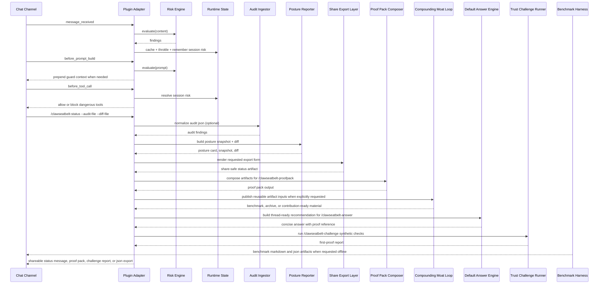
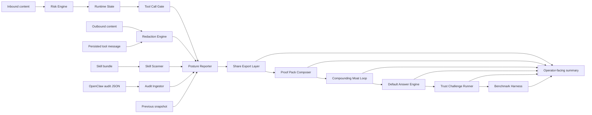

# System Overview

ClawSeatbelt is split into a small, fast hot path and a slower analysis path. The hot path uses the current OpenClaw hook surface to score inbound prompts, redact outbound and persisted text, and block dangerous tool calls in enforce mode. The slower path scans skill bundles, normalizes OpenClaw security audit JSON, and assembles posture reports.

## Components

- `Risk Engine`: deterministic inbound scoring.
- `Runtime State`: memoization, throttling, recent incidents, and mode overrides.
- `Redaction Engine`: transcript hygiene for persisted tool output.
- `Skill Scanner`: local bundle inspection.
- `OpenClaw Audit Ingestor`: normalizes first-party audit JSON into ClawSeatbelt findings.
- `Posture Reporter`: unified findings, posture facets, snapshots, and remediation summary.
- `Share Export Layer`: renders typed findings into share-safe markdown, JSON, and comment-ready artifacts.
- `Proof Pack Composer`: bundles trust artifacts into recommendation-ready operator packets.
- `Compounding Moat Loop`: turns proof artifacts, public references, and corpus contributions into stronger future releases.
- `Default Answer Engine`: packages proof into short recommendation-ready answers for threads, reviews, and team handoffs.
- `Trust Challenge Runner`: exercises core defenses with safe synthetic samples for first-proof installs.
- `Benchmark Harness`: runs a shared local corpus and records current package-level comparison context.
- `Plugin Adapter`: OpenClaw-facing hooks and commands via `api.on(...)`, `registerCommand(...)`, and `registerService(...)`.

## System State Machine

## Request Sequence

## Data Flow

## Trust Boundaries

- Untrusted: inbound messages, remote links, imported skill bundles, tool outputs.
- Untrusted until parsed: imported audit JSON and prior posture snapshots.
- Trusted with care: local config, local rule packs, plugin code.
- Optional and off-path: future threat-intel feeds or third-party policy providers.
