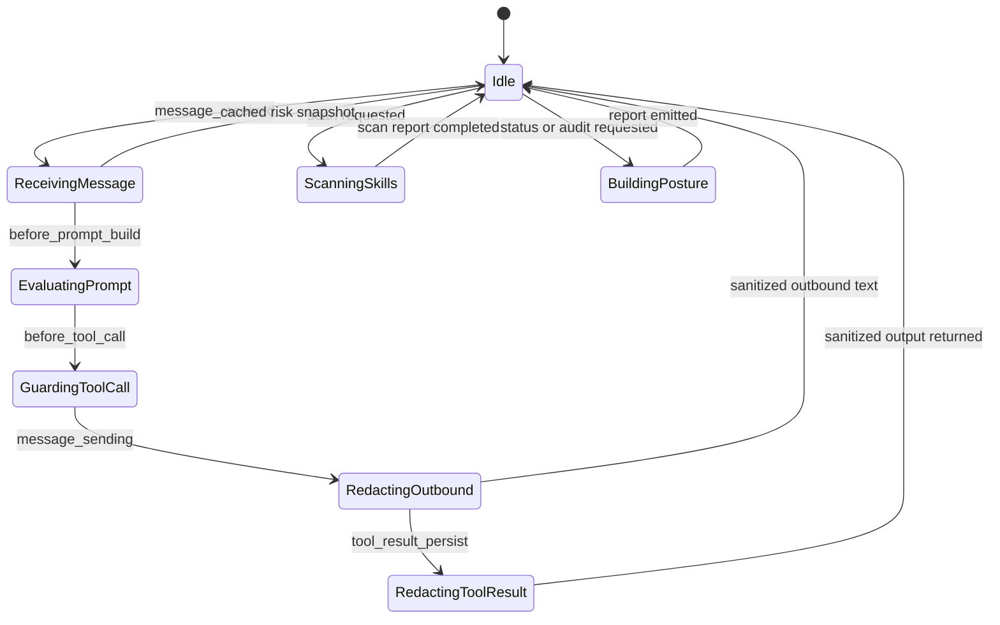
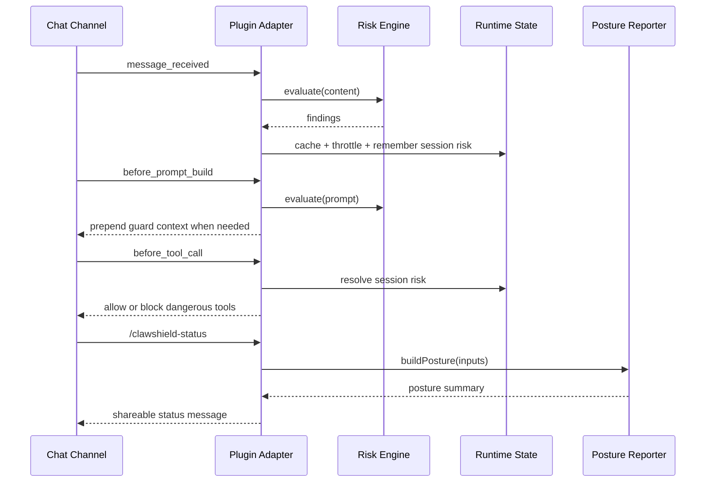
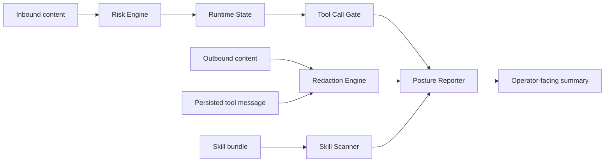

# System Overview

ClawShield is split into a small, fast hot path and a slower analysis path. The hot path uses the current OpenClaw hook surface to score inbound prompts, redact outbound and persisted text, and block dangerous tool calls in enforce mode. The slower path scans skill bundles and assembles posture reports.

## Components

- `Risk Engine`: deterministic inbound scoring.
- `Runtime State`: memoization, throttling, recent incidents, and mode overrides.
- `Redaction Engine`: transcript hygiene for persisted tool output.
- `Skill Scanner`: local bundle inspection.
- `Posture Reporter`: unified findings and remediation summary.
- `Plugin Adapter`: OpenClaw-facing hooks and commands via `api.on(...)`, `registerCommand(...)`, and `registerService(...)`.

## System State Machine

## Request Sequence

## Data Flow

## Trust Boundaries

- Untrusted: inbound messages, remote links, imported skill bundles, tool outputs.
- Trusted with care: local config, local rule packs, plugin code.
- Optional and off-path: future threat-intel feeds or third-party policy providers.
