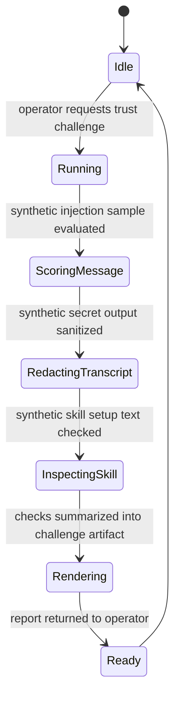
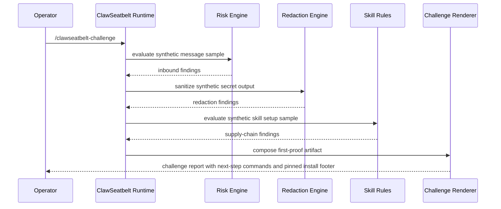
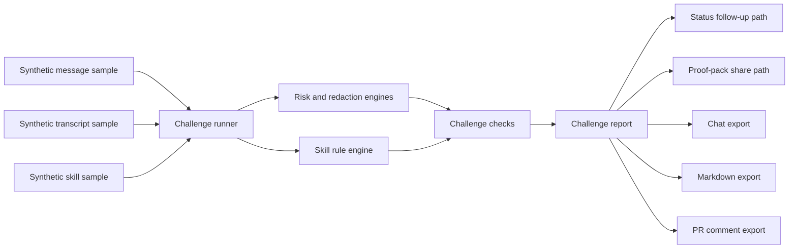

# Trust Challenge Architecture

## Purpose

ClawSeatbelt needs a first-proof surface that works on a clean install and does not depend on a live incident. The trust challenge gives operators a safe, synthetic way to verify that message scoring, transcript hygiene, and skill inspection are active.

Current runtime surface: `/clawseatbelt-challenge`

## State Machine

## Sequence Diagram

## Data Flow

## Design Guardrails

- The challenge must stay synthetic and safe to share.
- It proves the local defensive surfaces are wired, not that the whole environment is secure.
- It should work without files, accounts, or remote services.
- The artifact should tell the operator what was exercised, what still requires a live benchmark, and which share-safe path to use next.
