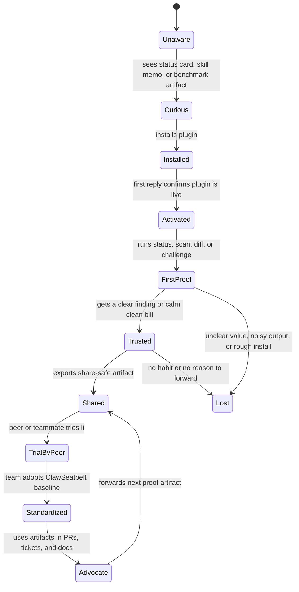
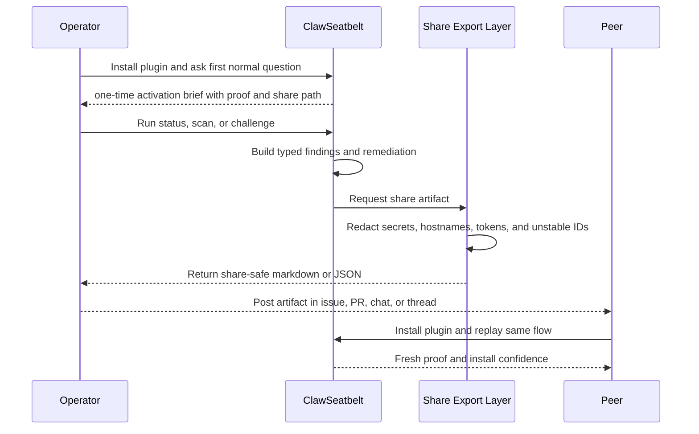
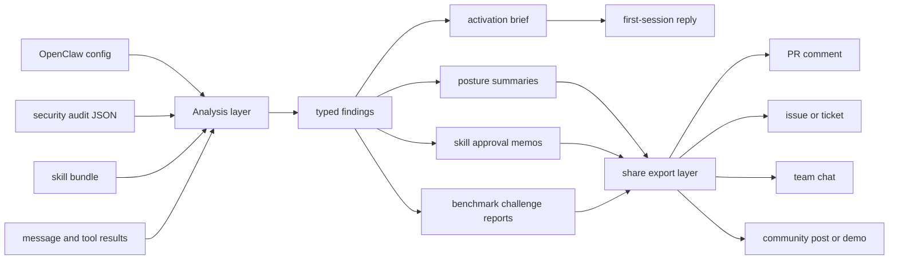

# Trust Loop Architecture

## Purpose

ClawSeatbelt should grow because it produces artifacts operators genuinely need to share. This document maps that loop so growth stays useful, safe, and composable.

## State Machine

## Sequence Diagram

## Data Flow

## Design Guardrails

- Shared artifacts must be useful even if the recipient never installs the plugin.
- Installed operators should get one calm activation cue before ClawSeatbelt disappears into the background.
- Redaction must run before any share export is rendered.
- Share paths must be explicit and user-driven. No auto-posting.
- Install hints belong in the footer, not as the whole artifact.
- The same typed findings should power local UX, exports, and docs.

## Backfire Checklist

- Does the artifact open with a decision summary instead of a product pitch.
- Could a skeptical engineer forward it without feeling they are forwarding an ad.
- Would the export still be safe if pasted into a public issue.
- Does a clean bill still feel useful, not smug or empty.
- Is the install path exact, pinned, and reproducible.
- Does the packet help at least one real support or review workflow without extra cleanup.
