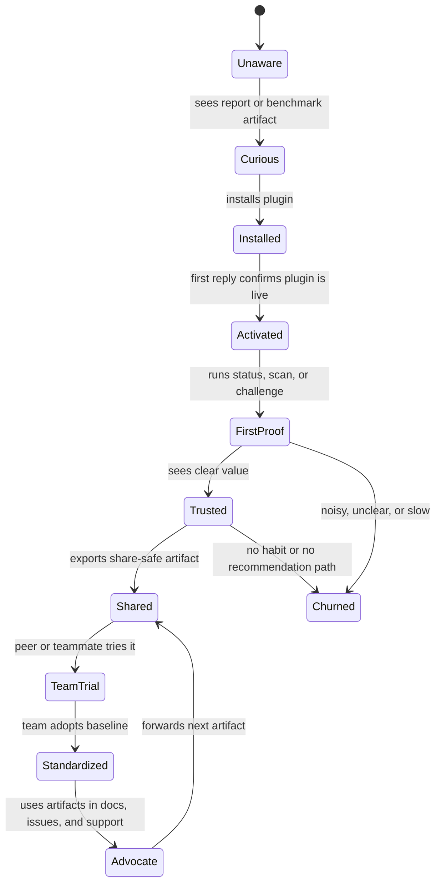
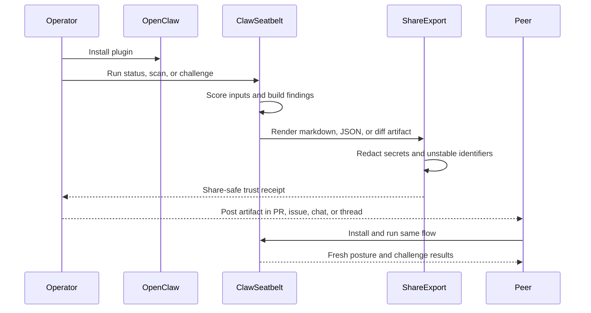
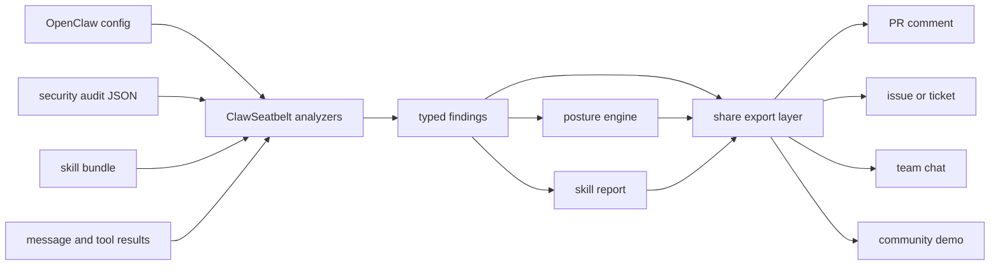

# ClawSeatbelt Plan

## Objective

Make ClawSeatbelt the default trust plugin for OpenClaw: the first install people recommend, the one cautious operators keep, and the baseline every competitor is forced to answer.

## The Real Win Condition

We do not become number one by matching every feature headline from MoltGuard, SecureClaw, PolicyShield, SafeFence, and Berry Shield. That path ends in sprawl.

We become number one by winning the rubrics users actually use to choose:

1. Fastest path to trust.
2. Lowest operational burden.
3. Clearest explanation of risk and remediation.
4. Strongest local baseline.
5. Best supply-chain hygiene before runtime damage begins.
6. Tightest composition with OpenClaw’s built-in controls.

If ClawSeatbelt owns those six, it becomes the default choice even when heavier systems still exist upstream.

## The Built-In Growth Loop

Security products do not spread because they ask to be shared. They spread because they settle a live question and produce an artifact worth forwarding.

That is the growth loop ClawSeatbelt should own:

1. A user installs the plugin and gets a useful trust receipt fast.
2. The next assistant reply confirms the plugin is active and points to the right first proof.
3. The receipt explains posture, risk, and next steps in clean language.
4. The user shares that artifact in a thread, issue, PR, or team chat to resolve a real decision.
5. The recipient sees the evidence, the remediation path, and the install path in one place.
6. The recipient installs ClawSeatbelt and repeats the loop.

This is the only kind of "viral hack" worth building here. It is not spam. It is not nagware. It is not forced referral logic. It is product-led distribution through useful proof.

See the system maps in [docs/architecture/trust-loop.md](docs/architecture/trust-loop.md).

## Elegant Distribution Principles

If ClawSeatbelt is going to spread, it has to spread with taste. That means every growth mechanic must survive the "read aloud in front of a skeptical engineer" test.

1. Proof before pitch. The artifact must solve the operator's problem before it mentions installation.
2. Consent before propagation. ClawSeatbelt can prepare a share artifact, never auto-post it.
3. Recipient value before sender vanity. The recipient should gain a clear decision aid even if they never install the plugin.
4. Redaction before export. Anything unsafe to forward must be cleaned or withheld by default.
5. Pinned install paths only. Shared install instructions should use exact package versions that fit OpenClaw's plugin safety model.
6. Calm tone over alarm theater. Clean systems should feel reassured. Risky systems should feel actionable, not hysterical.
7. Attribution in the footer. The product name belongs at the edge of the artifact, not in its throat.

## Backfire Risks We Must Design Out

| Failure Mode | Why It Backfires | Hard Rule |
|---|---|---|
| Share output looks like marketing copy | Operators stop trusting the artifact | Lead with evidence, remediation, and reproducibility. Keep install hints in the footer |
| False positives create theatrical warnings | Users uninstall or mute the plugin | Use severity discipline, evidence snippets, and clean-system language |
| Export leaks secrets or internal details | Trust collapses instantly | Run redaction before rendering and allow a stricter public mode |
| Auto-posting or nag prompts feel manipulative | Growth loop becomes reputational damage | No auto-send, no modal nags, no countdowns, no referral spam |
| Benchmark claims outrun reality | Competitors and users can discredit the product | Publish methodology, corpus, caveats, and raw artifacts before broad claims |
| Install instructions drift or break | Shared artifacts become dead ends | Generate pinned, tested install commands from release metadata |
| Attribution is too loud | The artifact feels like an ad | Keep branding minimal and subordinate to the operator brief |

## Current Position

### What Is Already True

- Core local plugin runtime exists.
- Inbound scoring, tool-result redaction, skill scanning, posture reporting, and runtime modes exist.
- Architecture docs, release docs, package metadata, tests, and a competitor artifact benchmark exist.
- The product already has a credible local-first thesis with no account requirement and no hot-path cloud dependency.

### What Is Still Missing

- live runtime proof inside a disposable OpenClaw instance
- side-by-side competitor benchmark evidence
- deeper skill supply-chain inspection
- richer install-time activation beyond the current one-brief path
- first-class posture orchestration around `openclaw security audit --json`, tool policy, exec approvals, pairing, and allowlists
- stronger provenance and release trust signals
- distribution proof: npm publication, community listing, and operator adoption loop

## Number One Scoreboard

These are the standards that turn "best plugin" from a slogan into a build discipline.

| Scoreboard Signal | Target Standard |
|---|---|
| Time to first proof | A clean install yields a meaningful posture or scan result in under five minutes |
| Time to first shareable artifact | A user can export a share-safe markdown artifact in one command and under thirty seconds |
| Operator comprehension | Findings explain what happened, why it matters, and what to do next without scanner jargon |
| Hot-path cost | Guardrails stay cheap enough that users do not disable them for comfort |
| Supply-chain clarity | Skill reports make trust expansion legible before a skill is enabled |
| Artifact trust | Packed output stays small, inspectable, reproducible, and easy to verify |
| Benchmark proof | Claims can be reproduced from a disposable OpenClaw lab with published methodology |
| Recommendation loop | A forwarded ClawSeatbelt artifact makes the install decision easier for the next operator |
| Taste | Shared artifacts feel like operator tools, not growth gimmicks |
| Selection dominance | The user sees enough proof at each decision step that choosing ClawSeatbelt feels lower-risk than not choosing it |

## Rubrics We Must Win

| Rubric | Current Position | Number One Standard |
|---|---|---|
| Local-first trust | Strong thesis, implemented baseline | No account, no server, no telemetry by default, no cloud in hot path, clear offline value on day one |
| Install friction | Good docs, package ready | One install, one command, one useful posture report within minutes |
| Operator comprehension | Good posture primitives | Findings read like a sharp operator brief, not scanner noise |
| Supply-chain safety | Early skill scanning exists | Best pre-install skill inspector in the ecosystem, with version pin, provenance, permission, and `curl \| bash` style risk detection |
| OpenClaw-native composition | Partial | Seamless posture view over `security audit`, tool policy, exec approvals, pairing, plugin allowlists, and transcript hygiene |
| Runtime guardrails | Baseline exists | Fast, deterministic, explainable hooks with strong audit and enforce semantics |
| Benchmark proof | Artifact benchmark only | Reproducible live corpus benchmark against top competitors in the same OpenClaw lab |
| Packaging and provenance | Ready but thin | Signed releases, provenance notes, reproducible pack checks, minimal footprint, transparent dependency story |
| Interoperability | Minimal | Optional export and bridge paths into PolicyShield style rules and hosted detectors without giving up the local baseline |
| Distribution and trust capture | Docs ready, not yet proven | Published package, community listing, benchmark write-up, memorable quickstart, and a demo corpus that makes the value obvious |
| Shareability | Early posture outputs exist | Every major output can become a redacted, share-safe artifact without manual cleanup |
| Recommendation rate | Still unproven | The plugin becomes the easiest serious answer in community support, issues, and operator handoffs |

## Competitive Response Map

### MoltGuard

Beat it on privacy, simplicity, and no-account operation. Do not try to out-market its hosted detection story. Later, offer an optional provider bridge if that helps adoption.

### SecureClaw

Beat it on clarity, composability, and day-one operator experience. Avoid script sprawl, installer drama, and "suite" bloat.

### PolicyShield

Beat it on zero-server baseline and time-to-value. Interoperate later by exporting policy packs or findings, not by copying its control plane.

### SafeFence And Berry Shield

Beat them on polish, documentation, verification rigor, and shareable posture UX. Early competitors often cover hooks. Few make the system feel inevitable.

### OpenClaw Built-Ins

Do not compete with first-party controls. Wrap them, explain them, and make them visible. If a user can get the same answer from `openclaw security audit --fix`, ClawSeatbelt must add explanation, sequencing, and continuous posture value.

## Product Pillars

### 1. Universal Local Baseline

ClawSeatbelt must remain genuinely useful without accounts, dashboards, or remote services. This is the wedge. Protect it.

### 2. Posture As A Product

The single most persuasive surface should be a compact, shareable posture report that turns scattered OpenClaw controls into one calm, legible view.

### 3. Skill Supply-Chain Defense

The market talks about runtime safety. The ecosystem’s real wound is unsafe trust expansion. Skill inspection must become a first-class moat.

### 4. Deterministic Guardrails

Hot-path behavior must stay cheap, typed, explainable, and predictable under audit and enforce modes.

### 5. Proof Over Claims

Every meaningful claim should be backed by a reproducible benchmark, a test corpus, or a live operator walkthrough.

### 6. Shareable Trust Artifacts

Every major surface should be able to produce something an operator can forward without embarrassment: short, accurate, redacted, and useful on its own.

### 7. Elegant Recommendation Design

Growth should emerge from restraint. The best artifact should feel like a memo from a sharp security engineer, with ClawSeatbelt quietly standing behind it.

### 8. Choice Architecture Mastery

Users do not choose on one axis. They move through a chain: search, listing, install, first proof, comparison, recommendation, and standardization. ClawSeatbelt needs to win each step cleanly.

## Growth Loop Maps

### Adoption State Machine

### Proof-Sharing Sequence

### Trust Artifact Data Flow

## Recommendation Surface Design

These are the product surfaces most likely to create earned distribution without backlash:

- trust receipt after install
- posture diff card after a fix
- skill approval memo before a risky skill is enabled
- benchmark challenge report against an unprotected baseline
- release proof note that shows why an upgrade matters

Each one should follow the same shape:

1. decision summary
2. evidence
3. remediation or next step
4. reproducibility note
5. quiet install footer

See the rendering path in [docs/architecture/share-export-system.md](docs/architecture/share-export-system.md).

## Choice Architecture We Must Win

### Step 1. Search Intent

When a user searches for an OpenClaw security plugin, they should immediately understand three things:

- ClawSeatbelt is local-first
- ClawSeatbelt handles posture, runtime hygiene, and skill trust in one plugin
- ClawSeatbelt is easier to verify than heavier alternatives

### Step 2. Listing Trust

The npm page, GitHub repo, and OpenClaw community listing must answer the review bar before a skeptical user has to ask:

- active maintenance
- clear install command
- visible docs and issue tracker
- explicit trust model
- evidence of quality through tests, benchmarks, and release notes

### Step 3. First Five Minutes

The first five minutes should produce one of two excellent outcomes:

- a risk finding that is specific, credible, and fixable
- a clean-bill artifact that proves the setup looks disciplined

Either result should make the install feel justified.

### Step 4. Comparison Moment

When a user compares ClawSeatbelt with MoltGuard, SecureClaw, PolicyShield, or built-in OpenClaw controls, the answer should be obvious:

- fastest path to useful proof
- clearest local trust model
- best explanation layer over first-party controls
- best pre-install skill safety story

### Step 5. Recommendation Moment

When someone asks, "What should I install to make OpenClaw safer," ClawSeatbelt should be the easiest serious answer because it has:

- a pinned install command
- a fast challenge flow
- a share-safe trust receipt
- benchmark-backed claims

### Step 6. Team Standardization

Once one operator adopts ClawSeatbelt, the product should make team spread natural through:

- PR and issue comment exports
- posture snapshots and diffs
- install receipts that double as evidence
- release proof notes that justify upgrades

## Proof Pack Strategy

The elegant "viral hack" should be a proof pack, not a pitch.

A proof pack is a compact set of artifacts that help someone else make a trust decision:

- trust receipt
- current posture card
- posture diff
- skill approval memo
- benchmark challenge result

The install command belongs inside the proof pack footer as a consequence of the proof, not as its opening move.

See the supporting maps in [docs/architecture/proof-pack-system.md](docs/architecture/proof-pack-system.md).

## Release Gates For Taste

No version should ship the recommendation path unless it passes these gates:

1. Public-share redaction passes on all export surfaces.
2. Clean-bill exports still feel useful and human.
3. Critical-risk exports are forceful without sounding theatrical.
4. Pinned install commands are generated from real release metadata.
5. Benchmark claims in copy match published methodology and raw artifacts.
6. A skeptical engineer can read the artifact aloud without hearing marketing varnish.

## Compounding Moats We Must Build

The best OpenClaw plugin does not only win once. It gets easier to choose every month because the product, the proof, and the public record reinforce each other.

### 1. Artifact Moat

The best trust receipts, posture diffs, skill memos, and proof packs should come from ClawSeatbelt. If the strongest artifacts in circulation already look like ClawSeatbelt, the selection battle starts half-won.

### 2. Corpus Moat

Every benchmark, reproduced attack, and safely curated skill sample should make the scanner and guardrails sharper. The corpus should improve from public research, synthetic fixtures, and explicit contributions, never from silent user harvesting.

### 3. Search Moat

Public proof should compound into discoverability. Benchmark pages, community answers, issue replies, and README surfaces should all answer the same question with the same trust model, so ClawSeatbelt becomes the canonical answer for OpenClaw security.

### 4. Standardization Moat

Once one careful operator adopts ClawSeatbelt, team spread should be easy. Snapshots, diffs, proof packs, and release notes should make it painless to turn a local habit into a team baseline.

### 5. Maintainer Moat

Community maintainers, security reviewers, and internal champions should find ClawSeatbelt useful as a language for explaining risk. The moment they use its artifacts to answer other people, the product starts winning distribution through utility.

## Measurement Without Betrayal

ClawSeatbelt should know whether the strategy is working without sneaking telemetry into a trust product.

Track success through public or explicit signals:

- npm downloads
- GitHub stars, forks, issues, and release adoption
- OpenClaw community listing presence and discussion mentions
- benchmark citations, backlinks, and public comparison threads
- public proof-pack examples in PRs, issues, docs, and team templates
- issue-template and support-template friction reports submitted deliberately by users

Do not track hidden behavioral analytics in the plugin. If measurement needs private data collection, the strategy is wrong.

## Social Proof Without Social Features

The wrong way to build momentum is to stuff the product with badges, counters, or nudges that imitate popularity. That breaks tone and weakens trust.

The right way is quieter:

- reproducible benchmark pages
- proof packs that survive public scrutiny
- maintainer answer kits
- clean install receipts
- issue and PR comments that help someone decide
- public archives of real examples

ClawSeatbelt should feel widely recommended because it is repeatedly useful in public, not because the UI performs popularity.

## The Default Answer Strategy

The number one plugin becomes the default answer before it becomes the biggest package.

That means ClawSeatbelt has to win the question, not just the install:

> "What should I add to OpenClaw first if I care about trust?"

The answer should be easy because ClawSeatbelt can supply:

- one pinned install command
- one five-minute trust challenge
- one benchmark-backed comparison page
- one proof pack that can be pasted into the thread immediately

If the recommendation takes a paragraph of caveats, the product has not won yet.

## Recommendation Ladder

The spread should follow an earned ladder:

1. Solo operator sees useful local proof.
2. Solo operator forwards a trust receipt or proof pack.
3. Teammate replays the proof and adopts the same baseline.
4. Maintainer or reviewer uses the artifact in a public answer.
5. Community threads and docs start naming ClawSeatbelt by default.
6. Competitors are judged against ClawSeatbelt's artifact quality, not just feature claims.

This is the elegant version of virality. Utility moves first. Brand follows.

## Strategic Workstreams

### Workstream A. Benchmark Truth

Status: `in_progress`

- [x] Build a local runtime benchmark harness that records corpus results, trust challenge output, and live competitor package metadata.
- [x] Create a shared local corpus covering prompt injection, secret-like outputs, and malicious skill bundles.
- [x] Extend the harness into a disposable OpenClaw lab with scripted install, config, and teardown.
- [x] Add a live competitor install and plugin-surface lab for ClawSeatbelt, MoltGuard, SecureClaw, PolicyShield, and Berry Shield.
- [ ] Run ClawSeatbelt, MoltGuard, SecureClaw, and PolicyShield against the same corpus where practical.
- [x] Publish methodology, caveats, and raw result artifacts in `docs/benchmarks/`.
- [x] Use results to tune product behavior before using them in external positioning.

### Workstream B. Unified Posture Engine

Status: `completed`

- [x] Ingest `openclaw security audit --json` into the posture report.
- [x] Model tool policy, exec approvals, pairing, plugin allowlists, and redaction settings as one posture graph.
- [x] Generate operator-facing remediation plans with clear priority and rationale.
- [x] Add a concise chat-native posture card and a machine-readable JSON export.
- [x] Support diff views so users can see posture changes over time.

### Workstream C. Skill Supply-Chain Moat

Status: `in_progress`

- [x] Expand the scanner to score unpinned installs, moving refs, install hooks, suspicious permission expansion, remote installer patterns, and hidden execution paths.
- [ ] Expand the scanner further to score script provenance and richer permission semantics.
- [ ] Add install-time and continuous-watch workflows so scanning happens before trust silently expands.
- [ ] Produce concrete remediation language, not only raw findings.
- [ ] Build a richer malicious and borderline corpus grounded in real ecosystem abuse patterns.
- [ ] Document what ClawSeatbelt can and cannot prove about a skill bundle.

### Workstream D. Runtime Guardrail Depth

Status: `pending`

- [ ] Deepen `before_prompt_build`, `before_tool_call`, `tool_result_persist`, and outbound message controls against real sample traffic.
- [ ] Add richer evidence objects and remediation metadata to every finding.
- [ ] Tighten enforce-mode policy around destructive tools and secret exfiltration paths.
- [ ] Preserve strict hot-path performance budgets with explicit tests.
- [ ] Add soak tests inside a live OpenClaw runtime.

### Workstream E. Trust, Packaging, And Provenance

Status: `in_progress`

- [ ] Publish the package and verify the install path from a clean machine.
- [ ] Add signed release and provenance automation where the toolchain supports it.
- [x] Ship a tiny, inspectable artifact with an explicit dependency story.
- [x] Add release verification steps that operators can run in minutes.
- [ ] Make the trust posture obvious in `README.md` and the community listing.

### Workstream F. Distribution And Adoption

Status: `pending`

- [ ] Publish the npm package and submit the OpenClaw community plugin listing.
- [ ] Ship a benchmark-backed quickstart that shows value in under five minutes.
- [ ] Prepare a minimal demo corpus so users can see redaction, posture, and skill scanning immediately.
- [ ] Create release notes that explain why to upgrade, not only what changed.
- [ ] Establish a release cadence that signals reliability without churn.

### Workstream G. Interoperability Without Surrender

Status: `pending`

- [ ] Export baseline findings or policy packs that server-backed systems can ingest.
- [ ] Explore an optional hosted-detector bridge that remains off by default and off the hot path.
- [ ] Keep the local baseline complete even when interop grows.

### Workstream H. Ethical Growth Loop

Status: `in_progress`

- [ ] Ship an install-time trust receipt that turns the first run into a share-safe markdown artifact.
- [x] Add share export surfaces for posture and scan outputs.
- [ ] Extend share export to benchmark outputs.
- [ ] Create a `clawseatbelt-challenge` style demo flow backed by a safe corpus that shows value in one session.
- [x] Create a built-in `clawseatbelt-challenge` flow backed by safe synthetic samples that shows value in one session.
- [ ] Generate issue comment, PR comment, and team-chat ready templates from the same typed findings.
- [ ] Redact secrets, personal identifiers, and unstable machine details before any share export leaves the local view.
- [ ] Keep the growth loop ethical: no auto-posting, no hidden telemetry, no nag screens, no forced referrals.

### Workstream I. Elegant Recommendation Engine

Status: `in_progress`

- [x] Design a canonical artifact grammar so every exported report reads with the same calm, operator-grade voice.
- [x] Add public, internal, and private export modes with escalating redaction and detail control.
- [x] Generate pinned install footers from actual release metadata so shared artifacts never suggest floating versions.
- [ ] Add a "clean system" export path that still feels worth forwarding when no critical findings exist.
- [ ] Build an anti-backfire review checklist into release readiness and docs review.
- [ ] Create examples of excellent PR comments, issue comments, and chat summaries from real benchmark and posture outputs.

### Workstream J. Choice Architecture And Proof Pack Dominance

Status: `in_progress`

- [x] Build a proof pack generator that bundles trust receipt, posture card, diff, and skill memo into a coherent export set.
- [x] Add explicit export targets for PR comments, issue comments, community help threads, and internal chat.
- [ ] Make clean-system outputs as recommendation-worthy as risk findings.
- [ ] Tune README, npm metadata, and community listing copy so all three echo the same concise trust model.
- [ ] Publish a benchmark-backed "why this is the default install" page that answers competitor comparisons directly.
- [ ] Add release gates for public-share safety, tasteful copy, and pinned install correctness.

### Workstream K. Compounding Moat And Trust-Safe Measurement

Status: `pending`

- [ ] Create a public corpus contribution path built from reproduced attacks, synthetic fixtures, and documented skill samples.
- [ ] Publish a benchmark and proof-pack archive so public evidence compounds instead of disappearing into release churn.
- [ ] Build a maintainer answer kit for PR comments, community help threads, and security review notes.
- [ ] Define a public signal dashboard sourced from npm, GitHub, community references, and benchmark backlinks.
- [ ] Add issue templates that capture install friction and export awkwardness without hidden analytics.
- [ ] Keep telemetry off by default and out of the hot path permanently.

### Workstream L. Default Answer Engine

Status: `in_progress`

- [x] Create a command-backed default answer renderer for support threads, PR reviews, issues, and team handoffs.
- [x] Create a maintainer answer kit with ready-to-use responses for support threads, PR reviews, and security discussions.
- [x] Build a five-minute trust challenge that can be linked in one line and reproduced from a clean install.
- [x] Ship a built-in trust challenge command as the first-proof path on a clean install.
- [x] Publish a concise "why ClawSeatbelt first" page that answers the default-install question with evidence, not slogans.
- [ ] Add example proof packs for solo operators, team leads, and maintainers so recommendation quality is modeled, not guessed.
- [ ] Curate a public gallery of real, redacted artifacts that show clean systems, risky systems, diffs, and skill memos.
- [ ] Define copy rules so public answers stay short, exact, and free of comparative overclaim.

## Product Surfaces That Should Market The Plugin For Us

- Install trust receipt: the first proof that OpenClaw posture is now legible.
- Posture diff card: the before and after artifact that proves a fix mattered.
- Skill approval memo: the report a user forwards before enabling a suspicious skill.
- Benchmark challenge pack: a fast, safe way to compare ClawSeatbelt against an unprotected baseline.
- Trust challenge report: a synthetic first-proof artifact that confirms the local defenses are wired before live benchmarking begins.
- Release proof note: a compact upgrade artifact that explains new trust value, not only new features.
- Clean bill note: a tasteful export that says "this setup looks disciplined" without sounding like a badge farm.
- Proof pack bundle: a multi-artifact export set that makes one support thread or PR enough to convert the next operator.
- Default answer kit: the exact response package that lets a maintainer recommend ClawSeatbelt in one calm paragraph.

## Execution Sequence

### Phase 0. Base Product

Status: `completed`

- [x] Foundation, architecture, runtime core, hardening pass, release docs, and artifact benchmark.

### Phase 1. Category Proof

Status: `in_progress`

- [ ] Live OpenClaw soak test.
- [ ] Competitor benchmark harness.
- [ ] Shared corpus and documented methodology.

### Phase 2. Default-Install Experience

Status: `in_progress`

- [x] Unified posture engine over first-party OpenClaw controls.
- [x] Better status surfaces and remediation plans.
- [ ] Install-time trust report that demonstrates value instantly.

### Phase 3. Supply-Chain Leadership

Status: `in_progress`

- [ ] Best-in-class skill inspection.
- [ ] Provenance and version trust checks.
- [ ] Continuous watch and richer corpus coverage.

### Phase 4. Proof That Spreads

Status: `in_progress`

- [ ] Install-time trust receipt.
- [x] Share-safe exports for status and scan flows.
- [ ] Share-safe diff-first exports.
- [x] Built-in trust challenge flow for clean installs.
- [ ] Benchmark challenge flow with publishable artifacts.
- [ ] Elegant recommendation grammar and pinned install footers.
- [ ] First proof pack bundle for support threads and PRs.

### Phase 5. Trust Capture

Status: `pending`

- [ ] npm publication.
- [ ] Community listing.
- [ ] Benchmark-backed public launch material.
- [ ] Public proof-pack and benchmark archive.

### Phase 6. Upmarket Interop

Status: `pending`

- [ ] Optional policy export and provider bridges.
- [ ] Team-ready integrations without bloating the baseline.

### Phase 7. Compounding Default Status

Status: `pending`

- [ ] Maintainer answer kit.
- [ ] Trust-safe measurement and public signal dashboard.
- [ ] Corpus contribution path and living benchmark archive.

### Phase 8. Default Answer Everywhere

Status: `in_progress`

- [x] Five-minute trust challenge published and verified.
- [x] Default-answer page and answer kit live.
- [ ] Public artifact gallery live with tasteful, redacted examples.

## Immediate Sprint

1. Publish `clawseatbelt` and verify fresh-install behavior.
2. Run ClawSeatbelt end to end in a disposable OpenClaw instance.
3. Build the first live benchmark harness and corpus.
4. Use the new posture snapshot and diff surface to drive install-time trust reporting.
5. Expand the skill scanner around provenance, remote installer, and permission-risk heuristics.
6. Add the first share-safe trust receipt and challenge artifact flow.
7. Submit the community plugin listing once the install path is proven.

## Anti-Goals

- Do not require accounts or hosted services for baseline protection.
- Do not drift into a vague "AI firewall" product story.
- Do not replace OpenClaw controls that already exist unless ClawSeatbelt adds clearer operator value.
- Do not add opaque magic that users cannot inspect or reason about.
- Do not let dashboards or control planes become prerequisites for trust.
- Do not use dark patterns, auto-posting, hidden telemetry, or referral gimmicks as a substitute for product value.
- Do not let growth copy sound more polished than the evidence it is carrying.
- Do not ship export surfaces that cannot pass a strict public-share redaction review.
- Do not let the product depend on scary results to spread. Clean systems must also create recommendation value.
- Do not build a growth plan that requires harvesting user data to understand whether it works.
- Do not confuse community presence with credibility. Every public answer must still carry proof.

## Definition Of Number One

ClawSeatbelt is number one when:

- a careful OpenClaw user can install it and get a useful posture report within minutes
- the local baseline is clearly stronger and easier to trust than hosted or server-bound alternatives
- skill supply-chain inspection is the best operator experience in the ecosystem
- live benchmark evidence shows ClawSeatbelt is competitive on the attacks users actually face
- the best artifacts in the ecosystem are generated by ClawSeatbelt and routinely forwarded in real operator workflows
- those artifacts feel elegant, useful, and safe enough that forwarding them increases trust instead of triggering skepticism
- the search result, listing, quickstart, first-run output, and proof pack all tell the same clear story with almost no friction
- public proof, corpus quality, and community answers keep compounding without violating the local-first trust model
- maintainers, reviewers, and experienced operators can recommend the plugin in one short answer because the evidence bundle is already prepared
- the plugin is the easiest serious recommendation to make in docs, threads, and community support
